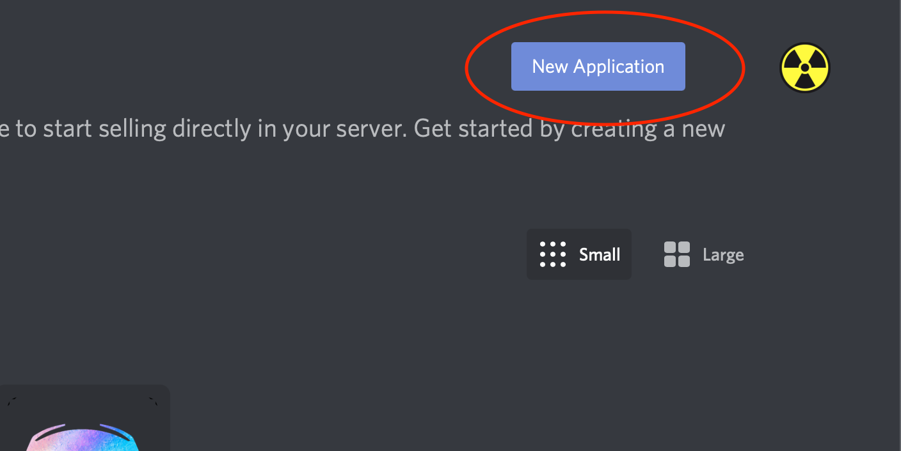
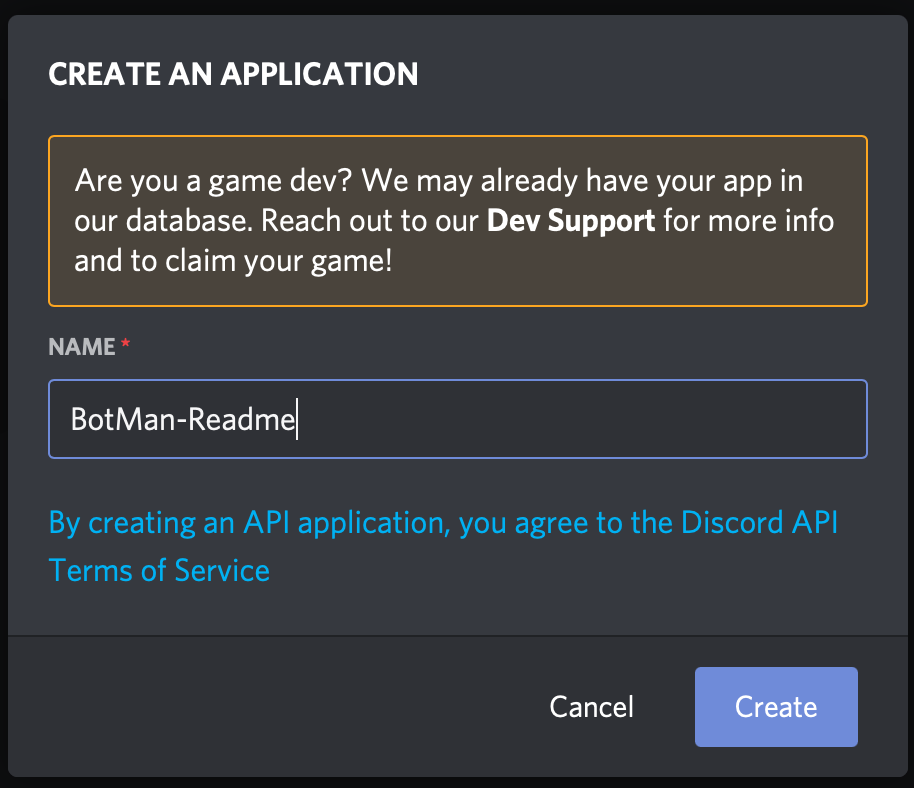
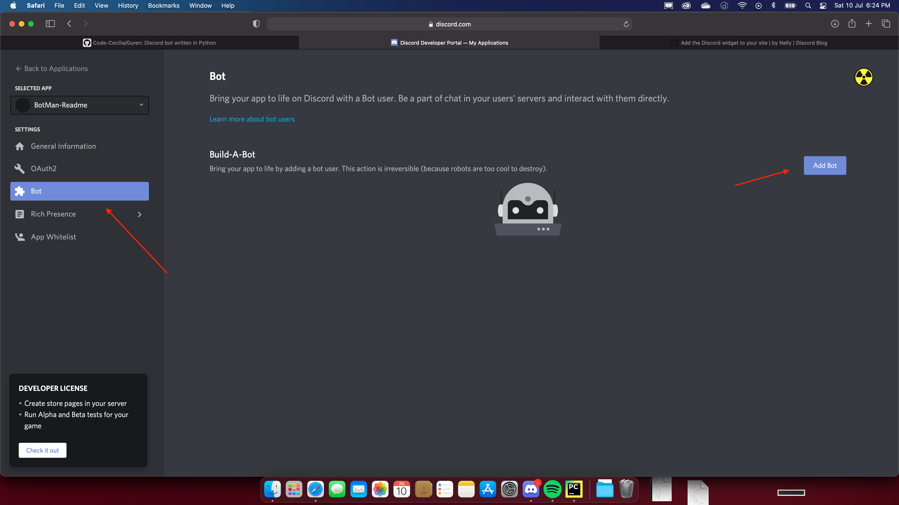
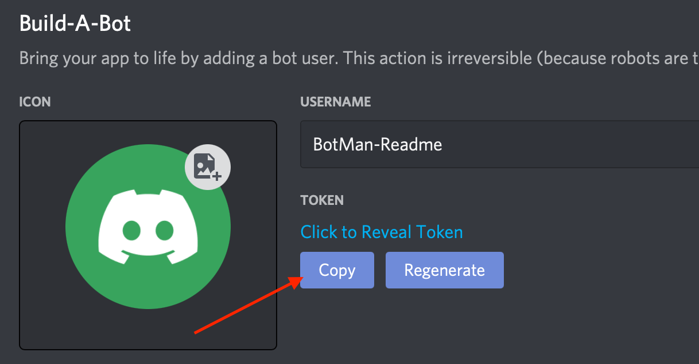
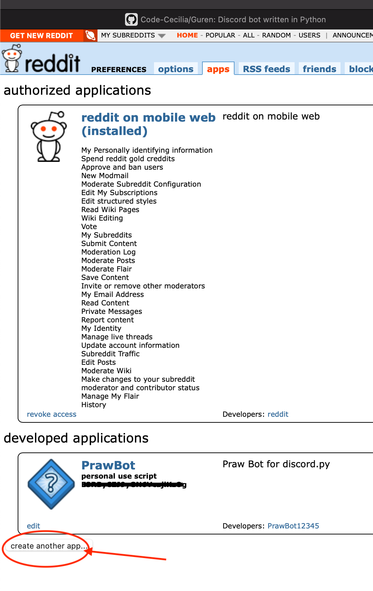
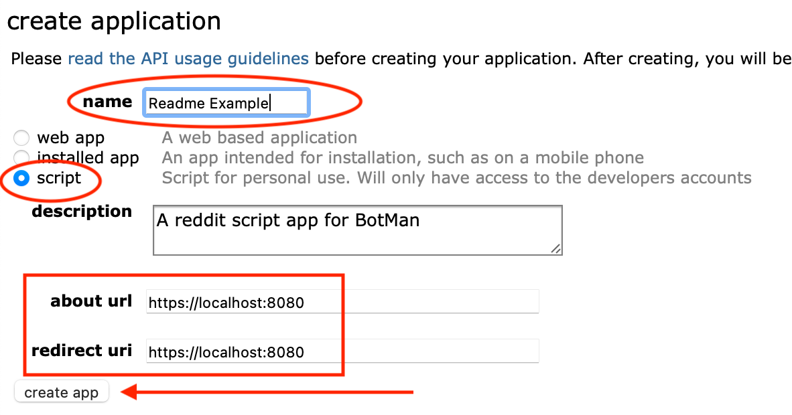
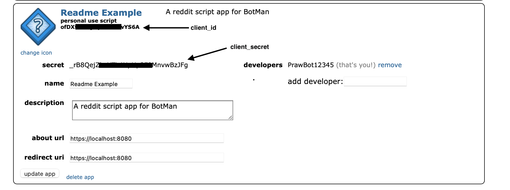

<h1 align="center">
  <br>
  <a href=""></a>
  <br>
  BotMan - A Discord bot
  <br>
</h1>

# BotMan

A discord bot written by [Mahasvan](https://github.com/Mahas1) in python using the library [Discord.py](https://discordpy.readthedocs.io/en/latest/index.html#)
Don't use my code without crediting. You are free to host it and fork it yourself but don't claim any of my code as yours.

# Usage and installation

Download the repo as zip or do the following below in a terminal window:

```bash
sudo apt-get install git
git clone https://github.com/Code-Cecilia/BotMan.py
``` 
`cd` into the project's directory and run this command
```bash
python3 -m pip install -r requirements.txt
```
Get to the [developer page](https://discord.com/developers/applications) and make a new application.









 Now that you have copied your token, paste it in `config.json` in its corresponding entry.

A properly set-up config.json looks something like this

```json
{
  "prefix_list": ["bm-", "Bm-", "$"],
  "main_prefix": "bm-",
  "token": "ODQ4NTI5xxxxx._cvTBeEHbk1z6iTtCHY92TFN5DU",
  "status_link": "https://www.youtube.com/watch?v=dQw4w9WgXcQ",
  "bio": "Hello! I am Botman, a bot written in Python by Mahasvan Mohan (github: Mahas1). \nI am open-source, and the source code for me can be viewed and downloaded here. Feel free to check it out!\nhttps://github.com/Mahas1/BotMan.py/"
}
```

# Setting up Reddit details

You're gonna need to setup an application for proper functioning of the Reddit Cog.

Go to [Reddit](https://www.reddit.com), and make a new account (or use the one you have). I don't think it matters.

The first step you need to do is turn on dark mode, because that's what cool people do 😎 (it's sarcasm)

Now go to the [Reddit Applications page](https://www.reddit.com/prefs/apps/) 

If you already have an app, you'd see something like this



If you don't have an app already, you'd see something like "Create an app"

What you need to do now, is to enter these details

 - Name - Enter a name for your application
 - Choose the `script` checkbox
 - set `about url` and `redirect url` as `https://localhost:8080` (if you know what you're doing, feel free to mess around.)
 - Click on `Create app`



Now, you'd see an entry for your application **above** the portion of the screen where you entered the details. (weird, I know.)

You can get the Client ID and Client Secret from these entries



Fill in the details for your reddit appication in `reddit_details.json`.
 - `client_id` is the Client ID we got from the application (the one under the application name in the above screenshot)
 - `client_secret` is the Client Secret we got from the entry called `secret`
 - `username` is the username of the Reddit account you used to make the application
 - `password` is the password of the Reddit account you used to make the application

A properly set-up `reddit_details.json` looks something like this.

```json
{
  "client_id" : "E3RXXXXXXXjlKzOg",
  "client_secret": "nEdXXXXXXXXXS_9tBYyo1Q",
  "username": "PrawBot12345",
  "password": "Praw1234"
}
```
(don't worry, the password is wrong)

And that should be it.
You can run `main.py` to run the bot. I'm working on a startup file, so bear with me till I finish it.

# Credits

[CorpNewt](https://github.com/corpnewt) for [CorpBot.py](https://github.com/corpnewt/CorpBot.py), from which I ~~stole~~ got the ideas of quite a few commands from.

[YuiiiPTChan](https://github.com/YuiiiPTChan0) for helping me with commands, and agreeing to work on the bot together.

[Discord.py](https://github.com/Rapptz/discord.py) for obvious reasons

[DhinakG](https://github.com/dhinakg), [Dids](https://github.com/Dids) for helping me with a few commands over in the r/Hackintosh Paradise discord server. 

I don't remember all of the people who helped me with this, sadly. I'd be more than glad to include if you in the credits. My discord is `mahasvan.exe#0001`. Please message me, I'll be sure to include you guys. You've been a **GREAT** help.


